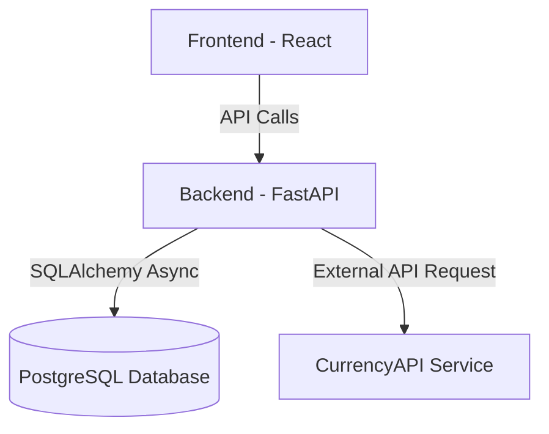

# 💱 Currency Converter App

Full-stack application for currency conversion with transaction history.  
Developed with **FastAPI (Python)**, **React (TypeScript)** and **PostgreSQL**, fully containerized with **Docker Compose**.

---

## 📋 Requirements

To run this project you need to have installed:

- [Docker](https://docs.docker.com/get-docker/)  
- [Docker Compose](https://docs.docker.com/compose/install/)  

Check if installed correctly:

```bash
  docker --version
  docker-compose --version
```

---

## 🚀 Getting Started

### 1️⃣ Clone the repository

```bash
  git clone https://github.com/acioly13/currency-converter-python
  cd currency-converter-python
```

---

### 2️⃣ Create `.env` file

Inside the project root, create a `.env` file with the following content:

```env
# Database
POSTGRES_USER=admin
POSTGRES_PASSWORD=admin123
POSTGRES_DB=currency_db
DATABASE_URL=postgresql+asyncpg://admin:admin123@db:5432/currency_db

# Currency API
CURRENCY_API_KEY=YOUR_API_KEY_HERE
```

⚠️ Replace `YOUR_API_KEY_HERE` with your [CurrencyAPI](https://currencyapi.com/) token.  
Without this, currency conversion will not work.

---

### 3️⃣ Build and start the application

Run the command:

```bash
  docker-compose up --build
```

This will start 3 services:
- **Backend (FastAPI)** → [http://localhost:8000](http://localhost:8000)  
- **Frontend (React)** → [http://localhost:5173](http://localhost:5173)  
- **Database (PostgreSQL)** → [localhost:5432](localhost:5432)  

---

## 📌 API Documentation

After starting the project, access the **interactive Swagger docs**:

👉 [http://localhost:8000/docs](http://localhost:8000/docs)

Main endpoints:
- `POST /convert` → Convert currency and store transaction  
- `GET /transactions?userId={id}` → List all transactions for a user  

---

## 🖥️ Frontend

The frontend provides:
- Currency conversion form  
- History of transactions per user  

👉 Access at [http://localhost:5173](http://localhost:5173)

---

## 🛠️ Tech Stack

- **Backend:** FastAPI, SQLAlchemy (async), PostgreSQL, Loguru, Pytest  
- **Frontend:** React, Vite, TypeScript, Axios, TailwindCSS  
- **Database:** PostgreSQL 15  
- **Containerization:** Docker, Docker Compose  

---

## 🧪 Running Tests

Run backend tests inside the container:

```bash
  docker exec -it currency_backend pytest
```

---

## 🧹 Useful Commands

Stop all services:

```bash
  docker-compose down
```

Rebuild containers:

```bash
  docker-compose up --build --force-recreate
```

---

## 🏗️ Architecture Decisions

- **Separation of concerns**: The project is divided into `backend` (FastAPI), `frontend` (React), and `db` (Postgres) services.
- **Containerization**: Everything runs through Docker Compose to simplify setup.
- **Async Backend**: The backend uses `FastAPI + SQLAlchemy Async` to handle concurrency efficiently.
- **External API integration**: Currency conversion rates are retrieved from [CurrencyAPI](https://currencyapi.com/).
- **Logging**: Centralized logging with **Loguru** for better debugging and error tracing.
- **Validation layer**: Pydantic models ensure request and response validation.

---

## 📂 Layered Organization

### Backend (`/backend/src`)

- **`main.py`** → FastAPI entrypoint, app setup (CORS, routes, lifespan).  
- **`db.py`** → Database configuration with SQLAlchemy Async.  
- **`init_db.py`** → Database initialization script.  
- **`logger.py`** → Logging configuration with Loguru.  
- **`models/`** → ORM models (e.g., `Transaction`).  
- **`schemas/`** → Pydantic schemas for request/response validation.  
- **`routes/`** → API routers (`transactions.py`).  
- **`tests/`** → Pytest test cases for endpoints.  

➡️ This structure separates **routers (controllers)**, **schemas (DTOs)**, and **models (database entities)** clearly.

### Frontend (`/frontend/src`)

- **`App.tsx`** → Main component with currency converter form.  
- **`components/TransactionList.tsx`** → Transaction history display.  
- **`services/api.ts`** → Axios client for backend communication.  
- **`index.css`** → Global styles.  
- **`main.tsx`** → React app entrypoint.  

➡️ The frontend is organized into **components**, **services**, and **styles** for maintainability.

---

## 🗂️ Architecture Diagram



---

## 🎯 Purpose

This project demonstrates the development of a **full-stack application** with:  
- Clean architecture separation (frontend, backend, database).  
- API-first backend with external API integration.  
- A user-friendly frontend that consumes the API.  
- Complete containerized environment to simplify setup for reviewers.  

---

## 👨‍💻 Author

Developed by **João Pedro Acioly**  
📧 john.acioly@gmail.com  
🔗 [LinkedIn](https://www.linkedin.com/in/joaoacioly/) | [GitHub](https://github.com/acioly13)